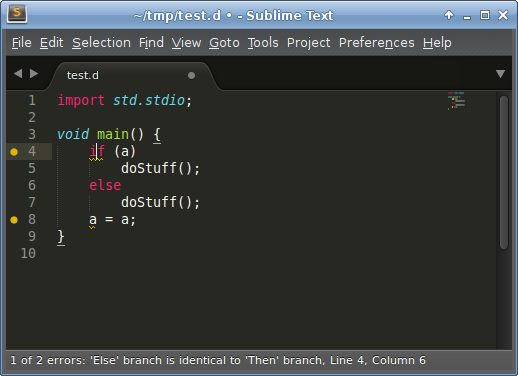

SublimeLinter-dscanner
======================

D-Scanner integration for SublimeLinter

### Installation

<ol>
	<li>Install <a href="http://www.sublimelinter.com/en/latest/installation.html">SublimeLinter</a></li>
	<li>Install <a href="https://github.com/Hackerpilot/Dscanner">D-Scanner</a> and place the executable on your PATH.</li>
	<li>
		<ul>
			<li>Linux: Download SublimeLinter-dscanner:<code><pre>cd ~/.config/sublime-text-3/Packages
git clone https://github.com/economicmodeling/SublimeLinter-dscanner.git</pre></code></li>
			<li>Mac: Download SublimeLinter-dscanner:<code><pre>cd ~/Library/Application\ Support/Sublime\ Text\ 3/Packages
git clone https://github.com/economicmodeling/SublimeLinter-dscanner.git</pre></code></li>
		</ul>
	</li>
</ol>
